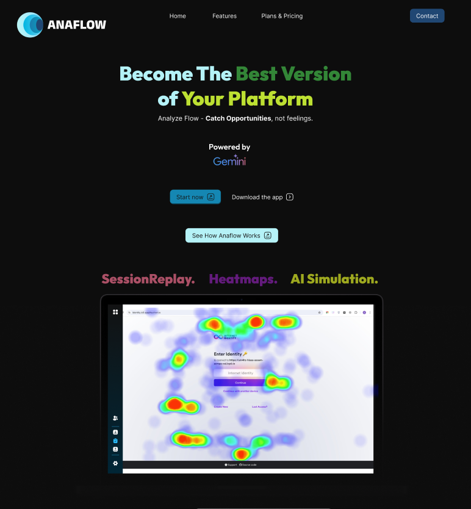
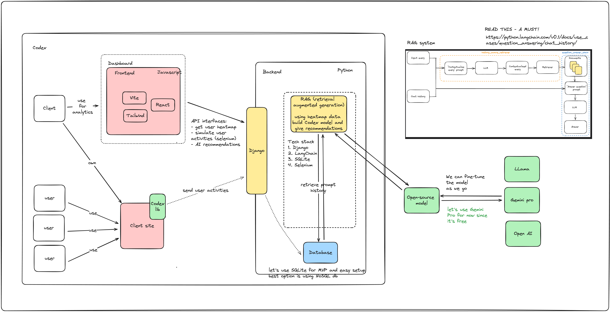

<h1 align="center">
    
</h1>

# CodeX Challenge  - Anaflow | AI Solution for Platform Analytics
## Become the Best Version of Your Platform - Catch Opportunities, Not Feelings

<h1 align="center">
    </a>
</h1>

# Core Features 1 - User Simulation's Data & Insight
1. **ReplaySession** - Rewind the user's complete journey and gain insights into their behavior to uncover hidden patterns
2. **Heatmaps** - Identify which areas are overlooked and discover the elements that matters
   
These both features can export the data into JSON format for further usage

# Core Features 2 - AI Simulation (Fine-Tuned LLM by Google Gemini)
Reimagine varied selections of user profiles and proceed with the simulation seamlessly.

# Project Architecture and Tech Stack
This repository follows a monorepo structure, encompassing both the Frontend and Backend components of the application.

## Architecture
The architecture of Codex is depicted in the diagram below

## Tech Stack
### Frontend
The Frontend of Codex utilizes the following technologies:
- **Vite**: A fast frontend build tool that provides a lightning-fast dev server and optimized build.
- **React**: A popular JavaScript library for building user interfaces.
- **Typescript**: A typed superset of JavaScript that compiles to plain JavaScript.

### Backend
The Backend of Codex is powered by:
- **Python**: A versatile and powerful programming language.
- **Django**: A high-level Python web framework that encourages rapid development and clean, pragmatic design.
- **LangChain**: An API for natural language processing tasks.
- **Gemini**: An abbreviation for "General Model Integration", serving as the Language Learning Model (LLM) component.

# How to run this project
## Frontend
To run the Frontend of Codex, please follow the instructions in the README located in the `/frontend` folder of this repository.

## Backend
To run the Backend of Codex, please follow the instructions in the README located in the `/backend` folder of this repository.
